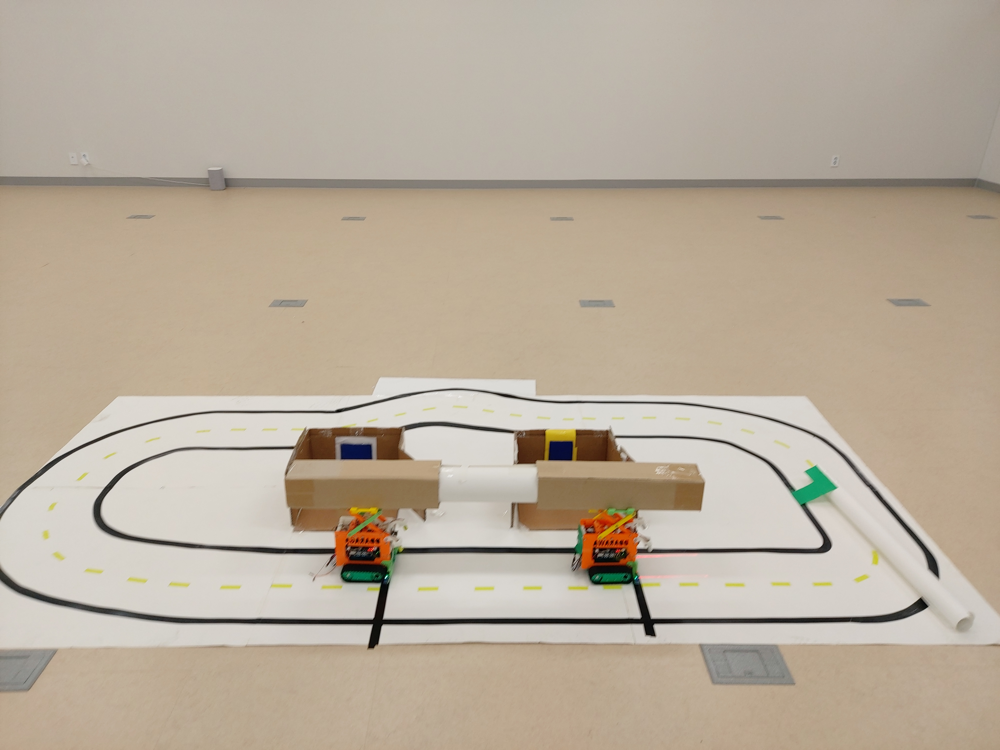
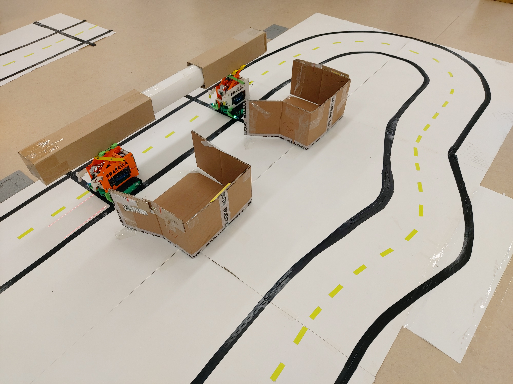
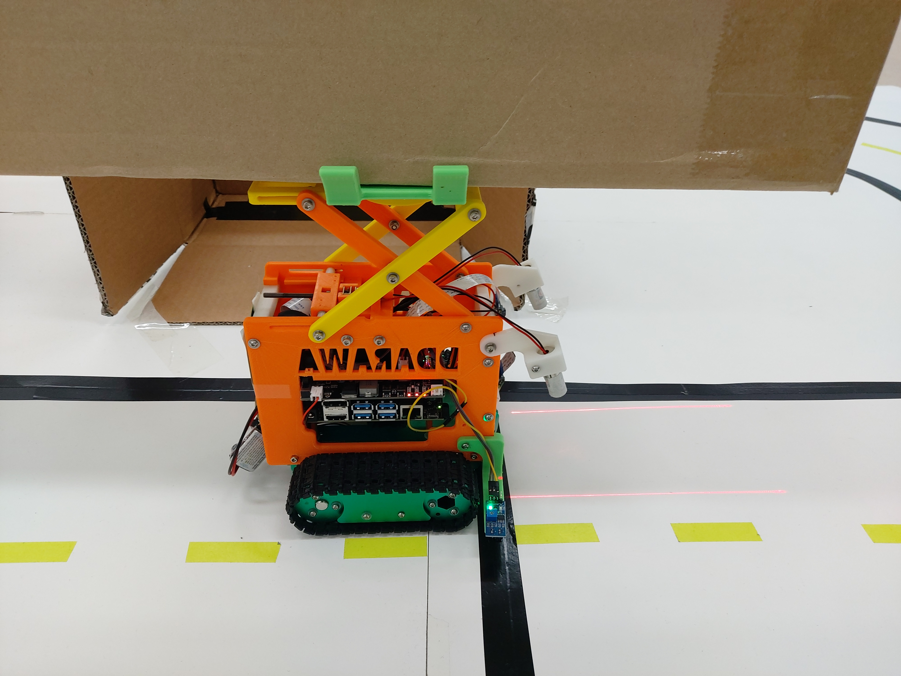
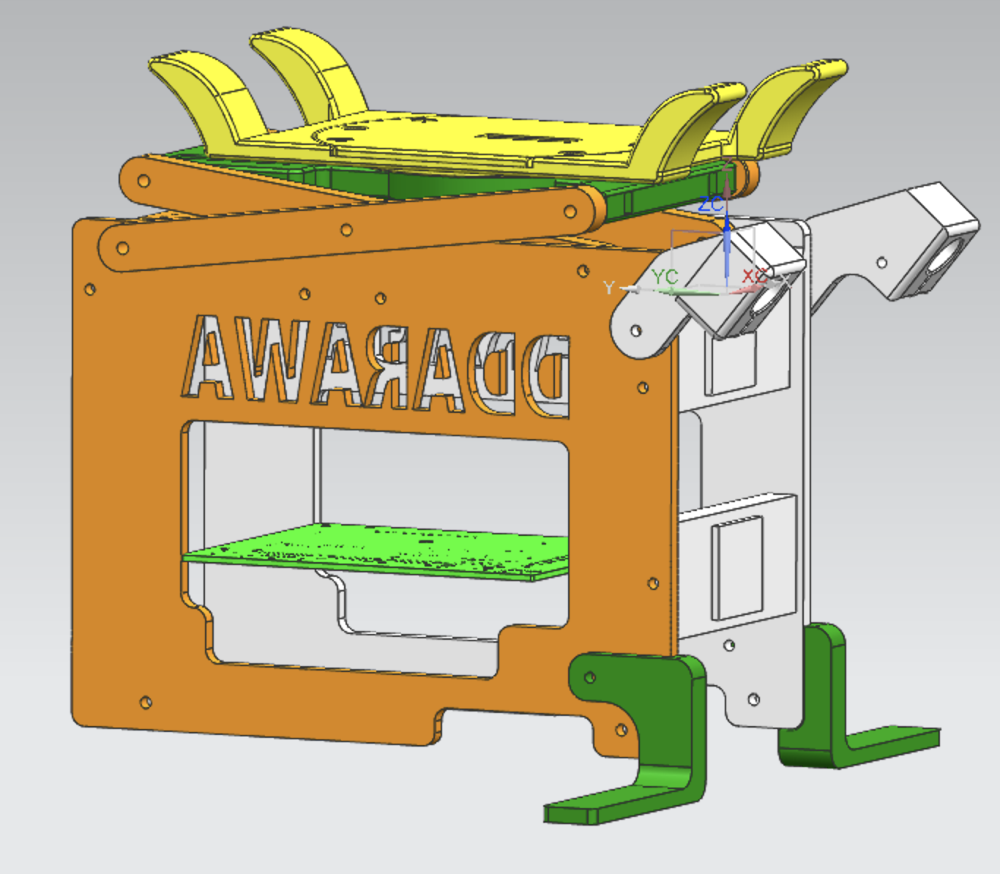
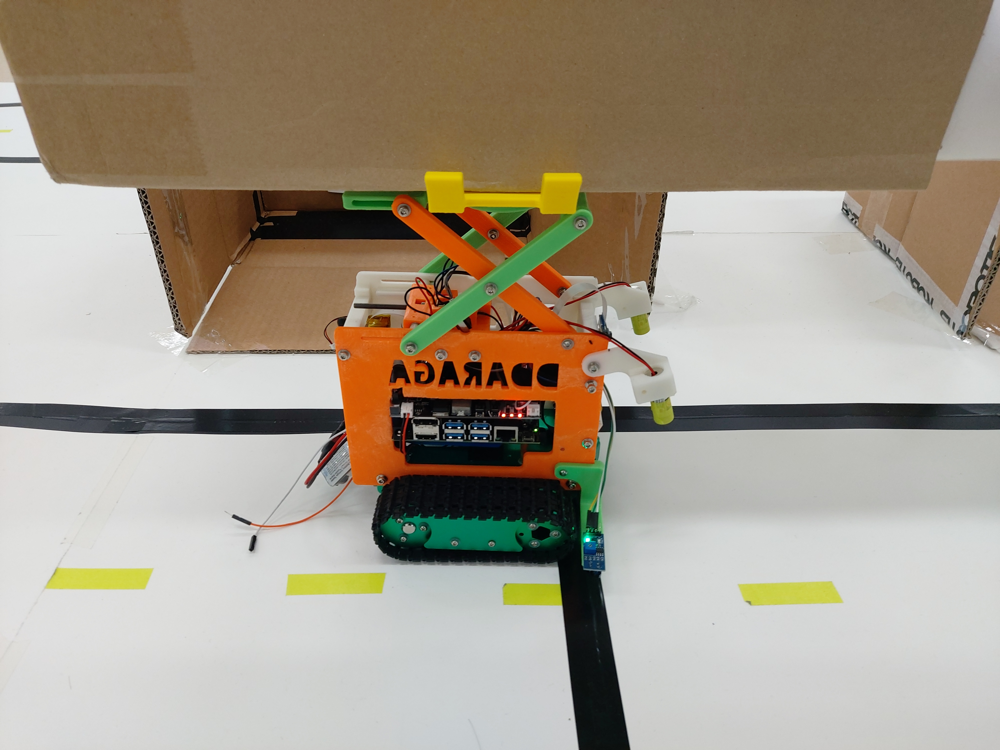
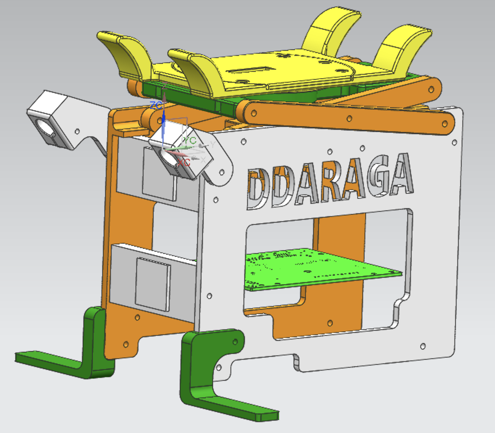

# AI 로봇 해커톤 in 마곡
 따라와라파

## 시연 순서
- 자율주행
- 따라가 주행
- 협동 작업 수행

## 아이디어 컨셉
- 기존의 문제점 
-약 3~5m 이상의 자재를 자율주행으로 이동시켜주는 이동체가 없다.

- 목표 해결방안 
-두 대 이상의 자율주행 로봇이 협업으로 이동미션을 수행한다.

## 적용 기술 개요
- 자율주행 Tensorflow Lite Classification
- 적외선 센서 주행 보조
- 색깔 감지 및 추적 알고리즘

## 전처리 환경 구현
- 자율주행 지도 설계 및 제작
- 데이터 수집 프로그램 제작
- 전처리 프로그램 제작

## 하드웨어
- 컨셉에 맞게 개조된 Yahboom Jetbot
- 적외선 속도 인코더 및 라인 트랙킹 개발
- 레이저 센서 적용
- 리프트 설계 및 3D 프린트
- 듀얼 카메라 장착

## 소프트웨어
### 자율 주행 (따라와라파)
- 딥러닝 classification을 이용한 방향 제어
- 적외선 센서 이용 주행 방향 보조
- transfer learning 
-alexnet, squeezenet, efficientnet, teacherable machine learning
- 개발 환경 
-jetpack 4.3 -> jetpack 4.6
-pytorch 1.0 -> pytorch 1.9
-tensorflow lite

### 공동 목표 수행 (따라가라파) 
- Lift Station 진출입 및 리프트 작업
- 적외선 센서를 이용한 Positioning
- Color Detection algorithm 코드 제작 (Lift Station 진입)
- Color tracking에 PID 제어 구현
- 협업하여 공동 목표를 이루는 군집주행
- 군집주행시 차간거리 유지 (Color Detection)

